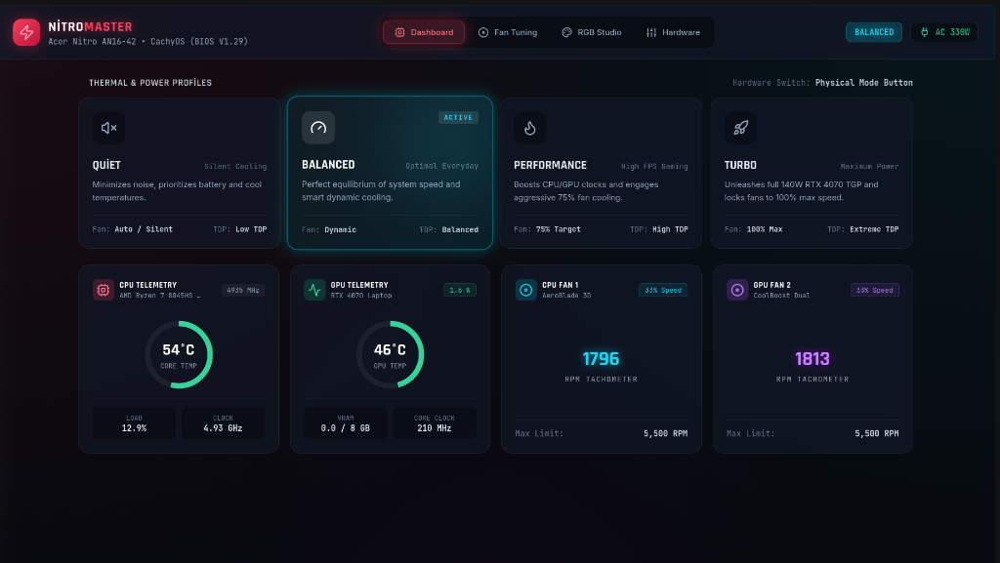
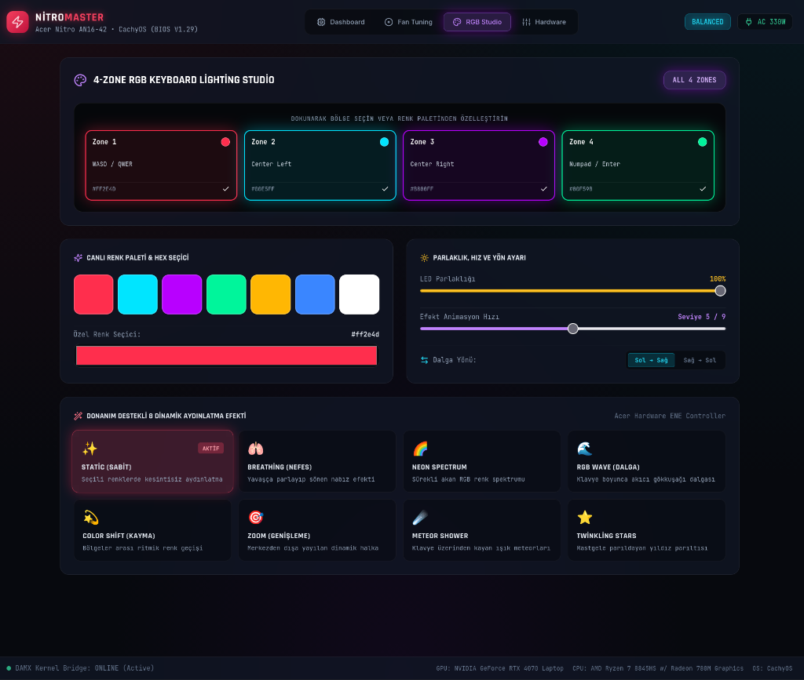

# ⚡ NitroMaster — Next-Gen Acer Nitro Control Center

<div align="center">

[](https://www.gnu.org/licenses/gpl-3.0)
[](https://cachyos.org)
[](https://vitejs.dev/)
[](https://tailwindcss.com/)

**Modern, Ultra-Fast & Sleek Hardware Control Dashboard for Acer Nitro Laptops (AN16-42 & More) on Linux.**

[🇹🇷 Türkçe Dökümantasyon İçin Tıklayın (README_TR.md)](README_TR.md)

</div>

---

## 📸 Screenshots

### 1. Dashboard & Live Hardware Telemetry
> Real-time CPU/GPU load, temperature, 140W RTX 4070 TGP power tracking, one-click thermal profile switching, and dual spinning AeroBlade 3D tachometers.



---

### 2. 4-Zone RGB Lighting Studio & 8 Hardware Effects
> Interactive 4-zone keyboard map, custom hex palette, 8 hardware lighting animations, speed (1-9), direction, and LED brightness slider.



---

## ⚠️ Critical Kernel Requirement: `linuwu_sense`

NitroMaster communicates directly with Acer Nitro Embedded Controllers (EC) through the **`linuwu_sense`** Linux kernel module:

* 🌀 **Fan Control:** `/sys/module/linuwu_sense/drivers/platform:acer-wmi/acer-wmi/nitro_sense/fan_speed`
* 🌈 **4-Zone RGB & 8 Effects:** `/sys/module/linuwu_sense/drivers/platform:acer-wmi/acer-wmi/four_zoned_kb/per_zone_mode` & `four_zone_mode`
* 🔋 **80% Battery Care Mode:** `/sys/module/linuwu_sense/drivers/platform:acer-wmi/acer-wmi/nitro_sense/battery_limiter`
* ⚡ **165Hz LCD Panel Overdrive:** `/sys/module/linuwu_sense/drivers/platform:acer-wmi/acer-wmi/nitro_sense/lcd_override`
* 🔌 **USB Power-Off Charging:** `/sys/module/linuwu_sense/drivers/platform:acer-wmi/acer-wmi/nitro_sense/usb_charging`

> [!IMPORTANT]
> **WITHOUT `linuwu_sense`, HARDWARE CONTROL COMMANDS WILL NOT FUNCTION.**  
> The interactive `./install.sh` script automatically detects `linuwu_sense`, and will prompt to download and build it with DKMS if missing.

---

## 🌟 Key Features

* 🎨 **Cyber-Dark Glassmorphism Design:** Modern neon aesthetic, responsive layout, 165Hz smooth UI transitions.
* ⚡ **Real-Time Telemetry & Hardware Sensors:**
  * **AMD Ryzen 7 8845HS:** Core temperature (°C), Clock speed (GHz), and % CPU load.
  * **NVIDIA GeForce RTX 4070 Laptop:** Real-time Power draw (**Watts / TGP**), Core & Memory MHz, VRAM usage.
  * **AeroBlade 3D Dual Fans:** Dynamic spinning SVG turbines synced to real RPM with live status tags.
* 🔘 **Instant Thermal & Power Profiles:**
  * **Quiet:** Silent operation, low TDP, whisper fans.
  * **Balanced:** Smart dynamic fan curve for everyday workflow.
  * **Performance:** 75% target fan curve, high clock boosts.
  * **Turbo:** Full 140W RTX 4070 TGP boost, 100% max fans.
  * **ECO (Saver):** Energy saver profile for maximum battery longevity.
* 🌈 **4-Zone RGB Keyboard Lighting Studio:**
  * Interactive 4-zone layout (WASD, Center-Left, Center-Right, Numpad).
  * Color presets + custom hex color picker.
  * **8 Hardware-Backed Lighting Effects:**
    1. ✨ *Static (Solid steady color)*
    2. 🫁 *Breathing (Pulsing breath)*
    3. 🌈 *Neon Spectrum (Smooth RGB rainbow cycle)*
    4. 🌊 *RGB Wave (Flowing wave)*
    5. 💫 *Color Shift (Rhythmic zone transitions)*
    6. 🎯 *Zoom (Expanding radial wave)*
    7. ☄️ *Meteor Shower (Rapid light streaks)*
    8. ⭐ *Twinkling Stars (Random starry glimmers)*
  * Animation Speed Slider (Level 1 - 9) & Direction Toggle (Left ➔ Right / Right ➔ Left).
  * LED Brightness Slider (%0 - %100).
* 🎛️ **Manual Fan Calibration:**
  * Auto, Max (%100 Turbo), or Custom independent CPU/GPU fan curves.
  * Single-toggle dual fan sync.
* 🔋 **Hardware & Battery Care:**
  * 80% Battery Care Limiter.
  * 165Hz LCD Panel Overdrive toggle (anti-ghosting).
  * USB Power-Off Charging.
  * Acer Boot Animation Sound toggle.
  * 30s Keyboard Backlight Auto-Sleep toggle.

---

## 🛠️ Quick Installation

Clone and run the interactive setup script:

```bash
git clone https://github.com/bymayfe/nitromaster-modern.git
cd nitromaster-modern
./install.sh
```

### What `./install.sh` Does:
1. Verifies if `linuwu_sense` is loaded (prompts to install via DKMS if missing).
2. Checks Node.js, npm, and Python 3.
3. Builds the React 19 production bundle (`npm run build`).
4. Configures and starts the background `nitromaster-bridge.service` user service.
5. Installs the desktop launcher into your application menu (`~/.local/share/applications/nitromaster.desktop`).

---

## 🚀 How to Launch

* **From Application Menu:** Search for `NitroMaster Control Center`.
* **From Terminal:**
  ```bash
  cd ~/Desktop/Projects/nitromaster-modern
  ./launch.sh
  ```
* **From Web Browser:**  
  Navigate directly to [http://127.0.0.1:16420](http://127.0.0.1:16420).

---

## 🏗️ Architecture & Tech Stack

* **Frontend:** React 19 + TypeScript + Vite + Tailwind CSS + Lucide Icons
* **Backend Bridge:** Python 3 `ThreadingHTTPServer` REST & Sysfs Telemetry Server (`127.0.0.1:16420`)
* **Hardware Drivers:** `linuwu_sense` DKMS Platform Driver + `/var/run/DAMX.sock`

---

## 📄 License

Distributed under the **GNU General Public License v3.0 (GPLv3)**. See [LICENSE](LICENSE) for more details.

---

<div align="center">
Made with ❤️ for the Linux & Acer Nitro Community by <b>Seyfettin (<a href="https://github.com/bymayfe">@bymayfe</a>)</b>
</div>
